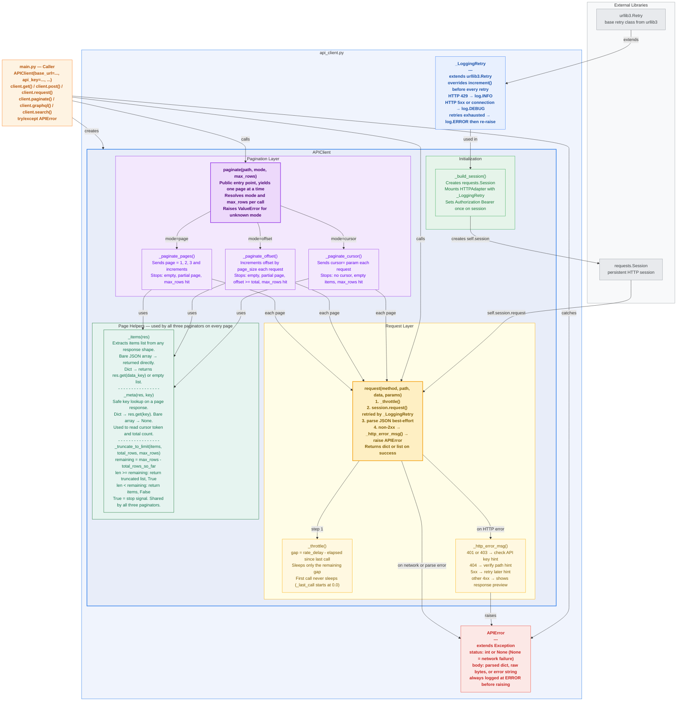

# api_client — Generic REST API Client

> A minimal, self-contained HTTP client for REST APIs. Designed for a small data team that needs reliable API calls without the overhead of a heavy framework.

Load it as a module into your api_script.py, configure via constructor kwargs, and go.

See `main.py` as an example.

---

## Architecture Overview



---

## Quick Start

```bash
pip install -r requirements.txt
```

```python
import os
from api_client import APIClient, APIError

client = APIClient(
    base_url = "https://api.example.com",
    api_key  = os.environ.get("API_KEY", ""),
)

# Single requests — convenience methods
user   = client.get("/users/42")
order  = client.post("/orders", data={"item": "widget", "qty": 3})
_      = client.put("/orders/7", data={"qty": 5})
_      = client.patch("/orders/7", data={"status": "shipped"})
_      = client.delete("/orders/99")

# Paginate — yields one page (list) at a time
for page in client.paginate("/orders", params={"status": "open"}):
    for order in page:
        print(order)

# Cap total rows fetched
for page in client.paginate("/events", max_rows=500):
    process(page)

# Error handling
try:
    client.get("/protected")
except APIError as e:
    print(e.status, e)   # 401  [GET /protected] HTTP 401 — Authentication failed ...
```

---

## File Structure

```
best_practice/api_client/
├── api_client.py        # APIClient class and APIError exception — import this
├── main.py              # Entry point: configures client, runs a demo against jsonplaceholder
├── test_api_client.py   # 31 unit tests covering the 6 test classes
└── requirements.txt     # requests, python-dotenv
```

---

## Constructor Arguments

All configuration is passed as keyword arguments to `APIClient()`. No files are read.

| Kwarg | Default | Description |
|---|---|---|
| `base_url` | *(required)* | Root URL of the API, e.g. `https://api.example.com` |
| `api_key` | `""` | Bearer token. Pass `""` for public APIs. |
| `api_key_env` | `"API_KEY"` | Env-var name shown in authentication error messages. The key itself is never logged. |
| `rate_delay` | `6.0` | Minimum seconds between requests. `6.0` → 10 req/min; `0.2` → 5 req/s. |
| `max_retries` | `4` | Retry attempts on 429 / 5xx before raising. Backoff: 0 s, 2 s, 4 s, 8 s. |
| `page_size` | `100` | Items per page for all pagination modes. |
| `timeout` | `30` | HTTP request timeout in seconds. |
| `pagination_mode` | `"cursor"` | Default pagination strategy: `"cursor"`, `"offset"`, or `"page"`. |
| `data_key` | `"data"` | Dict key holding the items list in paginated responses. Ignored when the API returns a bare JSON array. |
| `cursor_key` | `"next_cursor"` | Cursor mode: response key carrying the next-page token. Supports dot-notation (e.g. `"paging.next.after"`). |
| `cursor_param` | `"cursor"` | Cursor mode (GET): query-parameter name used to send the cursor on subsequent requests. Set to `"after"` for GitHub, `"page_token"` for Google, `"starting_after"` for Stripe. |
| `total_key` | `"total"` | Offset mode: response key carrying the total record count (enables early-stop). |
| `offset_param` | `"offset"` | Query-parameter name for the offset value (e.g. `"_start"` for JSONPlaceholder). |
| `limit_param` | `"limit"` | Query-parameter name for the page size, used by all three pagination modes. |
| `max_rows` | `None` | Cap total items returned across all pages. `None` fetches everything. Can be overridden per `paginate()` call. |
| `cursor_body_key` | `"after"` | Key in the POST body to carry the next-page cursor. Used by `search()` (POST-based pagination). |

---

## Retry, Backoff, and Timeout

Configure retry behaviour and timing entirely through the constructor:

```python
client = APIClient(
    base_url    = "https://api.example.com",
    api_key     = os.environ.get("API_KEY", ""),
    max_retries = 4,      # retry up to 4 times on 429 / 5xx
    timeout     = 30,     # seconds per request
    rate_delay  = 1.0,    # minimum gap between requests (1 req/s)
)
```

**Backoff schedule** (with `backoff_factor=1`, fixed internally): 0 s, 2 s, 4 s, 8 s. This is not configurable via the constructor.

**Retried status codes:** 429, 500, 502, 503, 504. The `Retry-After` header is respected when the server sends it — urllib3 honours it automatically.

After `max_retries` attempts are exhausted, an `APIError` is raised and logged at `ERROR`.

---

## Pagination Strategies

Choose the mode that matches your API. Set `pagination_mode` as the default in the
constructor, or override per call with the `mode=` argument.

### Cursor-based (`"cursor"`)

The API returns an opaque token with each response. The client passes it back
as a `cursor` query parameter on the next request.

**Stop condition:** response has no cursor token, or the items list is empty.

**Use when:** the API is HubSpot, Stripe, Twitter/X, Salesforce, or any modern
service that uses page tokens instead of numeric offsets. This is the safest
mode for large or frequently-changing datasets because it avoids the
drift/skip problem that offset pagination has under concurrent writes.

```python
client = APIClient(
    base_url        = "https://api.example.com",
    api_key         = os.environ.get("API_KEY", ""),
    pagination_mode = "cursor",
    cursor_key      = "next_cursor",   # or "after", "page_token", etc.
    limit_param     = "limit",
)

for page in client.paginate("/tickets", params={"status": "open"}):
    ...
```

### Offset/limit (`"offset"`)

The client tracks an integer offset and increments it by `page_size` after
each request. If the API returns a `total` count, the client uses it to stop
without making a final empty request.

**Stop conditions:** empty response, partial last page (`len < page_size`),
or `offset >= total` when the API provides a total.

**Use when:** the API is built on a SQL database and exposes `offset`/`limit`
(or equivalent) params. Common in Django REST Framework, FastAPI, and many
internal data APIs.

```python
client = APIClient(
    base_url        = "https://api.example.com",
    pagination_mode = "offset",
    offset_param    = "_start",        # adjust to match your API
    limit_param     = "_limit",
    total_key       = "total",
)

for page in client.paginate("/reports"):
    ...
```

### Page number (`"page"`)

The client increments a `page` counter starting at 1 and sends it as a query
parameter alongside the page size.

**Stop conditions:** empty response or partial last page.

**Use when:** the API uses a `page` + `limit` (or `per_page`) interface.
Common in GitHub, many older Rails/Django APIs, and any framework that
exposes page-number controls to end users.

```python
client = APIClient(
    base_url        = "https://api.example.com",
    pagination_mode = "page",
    limit_param     = "per_page",     # or "limit", "page_size"
)

for page in client.paginate("/repos", params={"sort": "updated"}):
    ...
```

### Overriding mode and max_rows per call

```python
# Override mode for a single call
for page in client.paginate("/legacy", mode="page"):
    ...

# Cap rows for this call only (overrides the constructor default)
for page in client.paginate("/events", max_rows=500):
    ...
```

---

## GraphQL

The client natively supports GraphQL APIs — they use HTTP POST, so no special transport is needed. Use the `graphql()` helper to send queries cleanly:

```python
# One-off GraphQL query
result = client.graphql(
    "{ user(id: 1) { name email } }",
    path="/graphql",          # defaults to /graphql
)

# With variables
result = client.graphql(
    query     = "query GetUser($id: ID!) { user(id: $id) { name email } }",
    variables = {"id": "42"},
)
```

`graphql()` sends `POST /graphql` with body `{"query": "...", "variables": {...}}` and returns the parsed response.

**Pagination over GraphQL is manual.** GraphQL schemas vary too widely to automate cursor extraction. Use `graphql()` in a loop and parse the cursor from the response yourself:

```python
cursor = None
while True:
    result = client.graphql(
        query     = "query ($after: String) { orders(first: 100, after: $after) { edges { node { id } } pageInfo { endCursor hasNextPage } } }",
        variables = {"after": cursor},
    )
    orders = result["data"]["orders"]
    process(orders["edges"])
    if not orders["pageInfo"]["hasNextPage"]:
        break
    cursor = orders["pageInfo"]["endCursor"]
```

---

## HubSpot-style POST Search Pagination

Some APIs — most notably HubSpot CRM search — use `POST` for fetching paginated data. The cursor for the next page is sent in the **POST body**, not as a query parameter.

Use the `search()` method with two extra constructor params:

- `cursor_body_key` (default `"after"`) — key in the POST body to set the next-page cursor.
- `cursor_key` now supports **dot-notation paths** (e.g., `"paging.next.after"`) to reach nested cursor values in the response.

```python
client = APIClient(
    base_url         = "https://api.hubapi.com",
    api_key          = os.environ.get("HUBSPOT_API_KEY"),
    data_key         = "results",           # HubSpot wraps items in "results"
    cursor_key       = "paging.next.after", # dot-notation nested path
    cursor_body_key  = "after",             # sent in POST body for next page
    limit_param      = "limit",
)

for page in client.search(
    "/crm/v3/objects/contacts/search",
    body = {
        "filterGroups": [{"filters": [{"propertyName": "email", "operator": "CONTAINS_TOKEN", "value": "example.com"}]}],
        "properties": ["email", "firstname", "lastname"],
    },
    max_rows = 500,
):
    for contact in page:
        process(contact)
```

`search()` sends `POST` for every page. On each subsequent page it merges `{cursor_body_key: <cursor>}` into the POST body. It stops when there is no cursor in the response, the page is empty, or `max_rows` is reached.

The internal `_deep_get(obj, key_path, default)` helper handles dot-notation traversal, so `cursor_key = "paging.next.after"` correctly extracts deeply nested cursor values from the response dict.

---

## Error Handling

All failures raise `APIError`. Catch it specifically — never catch bare
`Exception` in production pipelines.

```python
from api_client import APIClient, APIError

try:
    data = client.get("/protected-resource")
except APIError as e:
    print(e.status)   # HTTP status code (int), or None for network/parse failures
    print(e.body)     # parsed dict/list, raw bytes, or str error message
    print(e)          # human-readable message with remediation hint
```

### Error message reference

| Condition | `status` | Message includes |
|---|---|---|
| 401, 403 | `401` / `403` | "Authentication failed. Check your API key or token (env var '...')." |
| 404 | `404` | "Endpoint not found. Verify the path and resource ID." |
| 500–599 | `5xx` | "Server error. Retry later or check the API status page." |
| Other 4xx | `4xx` | "Client error. Check request parameters or body." + response preview |
| Non-JSON body on 2xx | `2xx` | "Response is not valid JSON. Got: ..." + byte preview |
| Network error (ConnectionError, Timeout, max retries exhausted) | `None` | "Request failed — ConnectionError: ..." |

Errors on 429 and 5xx are **retried automatically** up to `max_retries` times
before an `APIError` is raised.

---

## Logging

The client uses Python's standard `logging` module. **The table below is a reference
guide — it does nothing on its own.** Python's `logging` module requires a handler to
be configured before any output appears. `main.py` calls
`logging.basicConfig(level=logging.INFO, ...)` which writes to stderr. In Lambda or
other production environments you configure the handler differently (CloudWatch,
structured JSON, a file), but the messages the client emits are the same regardless.

The module logger name is `api_client`. You can target it specifically without
affecting the rest of your application:

```python
logging.getLogger("api_client").setLevel(logging.DEBUG)
```

No handlers are configured inside the library — that is always left to the caller.

### Log level reference

| Level | Where | What you see |
|---|---|---|
| `DEBUG` | `__init__` | Client config on startup: base URL, rate delay, retries, pagination mode |
| `DEBUG` | `__init__` | `"APIClient ready: https://…"` after successful initialisation |
| `DEBUG` | `_throttle` | `"Rate-limiting: sleeping 0.340s"` — only when a sleep actually happens |
| `DEBUG` | `request` | Full request URL before the request is sent |
| `DEBUG` | `request` | `"JSON parse failed — …"` when a response body is not valid JSON |
| `DEBUG` | `request` | Response byte size on success |
| `DEBUG` | `request` | `"empty/no-content response"` on HTTP 204 |
| `DEBUG` | pagination | `"Starting pagination: path=… mode=… page_size=… max_rows=…"` |
| `DEBUG` | pagination | `"Fetching page N"` with offset/cursor/page details |
| `DEBUG` | pagination | `"Page N → X items"` after each successful page |
| `DEBUG` | pagination | Stop-reason message: empty response / no cursor / partial page / total reached |
| `INFO` | `request` | `"GET /orders → HTTP 200"` — one line per HTTP request/response |
| `INFO` | `_LoggingRetry` | `"Rate-limited (HTTP 429): … — 3 attempt(s) remaining"` |
| `INFO` | pagination | `"max_rows (N) reached after page P — stopping"` |
| `INFO` | pagination | `"Offset pagination complete: /orders — 5 pages, 487 rows total"` |
| `ERROR` | `request` | Full actionable message before every `APIError` is raised |
| `ERROR` | `request` | `"[GET /orders] Request failed — ConnectionError: …"` on network failure |
| `ERROR` | `_LoggingRetry` | `"Max retries exhausted: GET … — last status HTTP 500"` |

### Activating logging

```python
import logging

# Development — see everything
logging.basicConfig(level=logging.DEBUG, format="%(asctime)s %(levelname)s %(message)s")

# Production — request audit trail + pagination summaries + all errors
logging.basicConfig(level=logging.INFO, format="%(asctime)s %(levelname)s %(message)s")
```

### The `_LoggingRetry` class

urllib3's built-in `Retry` handles the mechanics of retrying but gives no
visibility into what it is doing. `_LoggingRetry` is a thin subclass that
overrides `increment()` — the single method called before every retry attempt
— to emit structured log messages:

- **HTTP 429** → `log.info`: rate-limiting is visible at `INFO` so operators
  see it without enabling `DEBUG`.
- **Other retried errors (5xx, connection errors)** → `log.debug`: keeps
  `INFO` output clean during transient blips.
- **Retries exhausted** → `log.error` before re-raising: the failure is
  always visible regardless of the caller's log level.

The subclass is an internal implementation detail (`_LoggingRetry`) — callers
never interact with it directly.

### Sample output

**`INFO` level** — production-style, one line per request plus summaries:

```
2024-01-15 10:23:01 INFO GET /orders → HTTP 200
2024-01-15 10:23:02 INFO GET /orders → HTTP 200
2024-01-15 10:23:02 INFO GET /orders → HTTP 429
2024-01-15 10:23:02 INFO Rate-limited (HTTP 429): GET https://api.example.com/orders — waiting before retry (3 attempt(s) remaining)
2024-01-15 10:23:05 INFO GET /orders → HTTP 200
2024-01-15 10:23:06 INFO GET /orders → HTTP 200
2024-01-15 10:23:06 INFO Offset pagination complete: /orders — 5 pages, 487 rows total
```

**`DEBUG` level** — development/troubleshooting, full trace:

```
2024-01-15 10:23:01 DEBUG Setting up APIClient: base_url=https://api.example.com  rate_delay=0.2s  max_retries=4  pagination=offset
2024-01-15 10:23:01 DEBUG APIClient ready: https://api.example.com
2024-01-15 10:23:01 DEBUG Starting pagination: path=/orders  mode=offset  page_size=100  max_rows=None
2024-01-15 10:23:01 DEBUG Offset: fetching page 1 (offset=0, limit=100) from /orders
2024-01-15 10:23:01 DEBUG → GET https://api.example.com/orders?limit=100&offset=0
2024-01-15 10:23:01 INFO  GET /orders → HTTP 200
2024-01-15 10:23:01 DEBUG Offset: page 1 → 100 items
2024-01-15 10:23:01 DEBUG Rate-limiting: sleeping 0.180s
...
2024-01-15 10:23:06 DEBUG Offset: partial page (87 < 100) on page 5 — done
2024-01-15 10:23:06 INFO  Offset pagination complete: /orders — 5 pages, 487 rows total
```

**Error case** — visible at any log level:

```
2024-01-15 10:23:01 INFO  GET /orders → HTTP 401
2024-01-15 10:23:01 ERROR [GET /orders] HTTP 401 — Authentication failed. Check your API key or token (env var 'API_KEY').
```

---

## Method Reference

### Public Methods

| Method | Purpose |
|---|---|
| `request(method, path, data, params)` | Low-level: send any HTTP request, return parsed JSON |
| `get(path, params)` | Shorthand for GET requests |
| `post(path, data, params)` | Shorthand for POST requests |
| `put(path, data, params)` | Shorthand for PUT requests |
| `patch(path, data, params)` | Shorthand for PATCH requests |
| `delete(path, params)` | Shorthand for DELETE requests |
| `graphql(query, variables, path)` | Execute a GraphQL query via POST |
| `paginate(path, params, page_size, mode, max_rows)` | Generator that yields pages; supports cursor, offset, and page modes |
| `search(path, body, page_size, max_rows)` | POST-based cursor pagination (HubSpot-style) |

### Private Methods

| Method | Purpose |
|---|---|
| `_build_session(api_key, max_retries)` | Create `requests.Session` with retry adapter |
| `_throttle()` | Enforce minimum inter-request delay |
| `_http_error_msg(method, path, status, body)` | Build actionable error message with remediation hint |
| `_items(res)` | Extract items list from response (bare array or dict wrapper) |
| `_meta(res, key)` | Safe dict-key lookup; returns `None` for bare arrays |
| `_deep_get(obj, key_path, default)` | Traverse a nested dict using a dot-notation key path |
| `_truncate_to_limit(items, total_rows, max_rows)` | Apply per-call row cap; returns `(items, stop_flag)` |
| `_paginate_cursor(path, params, page_size, max_rows)` | Cursor-based pagination implementation |
| `_paginate_offset(path, params, page_size, max_rows)` | Offset-based pagination implementation |
| `_paginate_pages(path, params, page_size, max_rows)` | Page-number pagination implementation |
| `_paginate_search(path, body, page_size, max_rows)` | POST cursor pagination implementation (used by `search()`) |

---

## Key Design Decisions

### Why requests?

`requests` wraps urllib3 with a cleaner interface: `session.request()` handles
URL encoding, JSON body serialisation, and auth headers automatically, removing
~20 lines of manual plumbing from `request()`. Because `requests` uses urllib3
internally, `HTTPAdapter(max_retries=_LoggingRetry(...))` works without
modification — our retry logging hook survives the switch unchanged. Auth
headers are set once on the `Session` rather than rebuilt per request.

### Why explicit constructor kwargs?

In code visible values as arguments rather than loading a separate config file means:
- **IDE completion and type hints** — editors show every option and its default.
- **Config lives next to the call site** — the `APIClient(...)` block in
  `main.py` is the single source of truth; no parallel YAML file to keep in sync.

### Why three pagination modes in one class?

Different APIs in the data ecosystem use different conventions. Cursor mode covers modern APIs (HubSpot, Stripe); offset/limit covers SQL-backed services; page numbers cover GitHub and older frameworks. A single `paginate()` entry point with a `mode` parameter keeps the caller interface simple — one method to learn, three behaviours via config.

### Why parse JSON before checking the HTTP status?

Some APIs return meaningful JSON error bodies on 4xx responses (validation errors, rate-limit details). Others return plain text. Parsing best-effort first means callers always get the richest available information, but the HTTP status message always takes priority so the error is never misclassified as a parse failure.

### Why `_LoggingRetry` instead of wrapping `request()`?

Retry logic lives inside urllib3's connection pool. By the time `request()` sees a response, transient errors have already been retried silently. Wrapping `request()` with a try/except only catches failures after all retries are exhausted. Subclassing `Retry.increment()` is the only reliable hook that fires on every attempt — including the ones that succeed on a subsequent try.

### Why `log.error` before raising, not just raising?

Raising `APIError` passes the error to the caller, but not every caller logs it — some catch it and continue. `log.error` ensures the failure appears in the log stream immediately, regardless of what the caller does with the exception. This matters in pipeline contexts where a caught error might be silently skipped but still needs to be auditable.


---

## Future Improvements

### Add API key rotation

Store multiple keys as a list and round-robin or retry with the next key on
429. Implement as a method on `APIClient` that replaces `self.api_key` and
rebuilds `self.session` via `_build_session`.

### Redirect logs to a file or structured sink

```python
handler = logging.FileHandler("api_client.log")
handler.setFormatter(logging.Formatter("%(asctime)s %(levelname)s %(message)s"))
logging.getLogger("api_client").addHandler(handler)
```

For JSON-structured logs (e.g. for Datadog or CloudWatch), swap the formatter
for a JSON formatter such as `python-json-logger`.

### Switch to OAuth 2.0 / token refresh

Subclass `APIClient`, override `request()` to catch `APIError` with
`status == 401`, refresh the token, update `self.api_key`, rebuild
`self.session`, and retry once. The base `request()` stays unchanged.

### Replace requests with httpx for async support

Swap `requests.Session.request()` for `httpx.AsyncClient.request()` and make
`request()` and `paginate()` async. The rate limiter becomes `asyncio.sleep(gap)`.
`_LoggingRetry` becomes an httpx event hook. The public interface does not change.

---

## Running Tests

```bash
python -m unittest test_api_client.py -v
```

Tests use only the standard library (`unittest`, `unittest.mock`). No network
calls are made. The six test classes cover:

| Class | What is tested |
|---|---|
| `TestRateLimiting` | First call does not sleep; subsequent calls sleep only the remaining gap |
| `TestUrlEncoding` | Params dict is passed intact to requests (spaces, ampersands, multiple keys) |
| `TestHttpErrors` | 401, 403, 404, 422, 500 each raise `APIError` with the right message; network errors raise `APIError` with `status=None` |
| `TestPagination` | All three modes stop correctly; cursor token forwarded on second call |
| `TestJsonParseFailure` | Non-JSON and invalid UTF-8 bodies raise `APIError` with a preview |
| `TestMaxRows` | `max_rows` cap stops pagination early and truncates the final page correctly |
